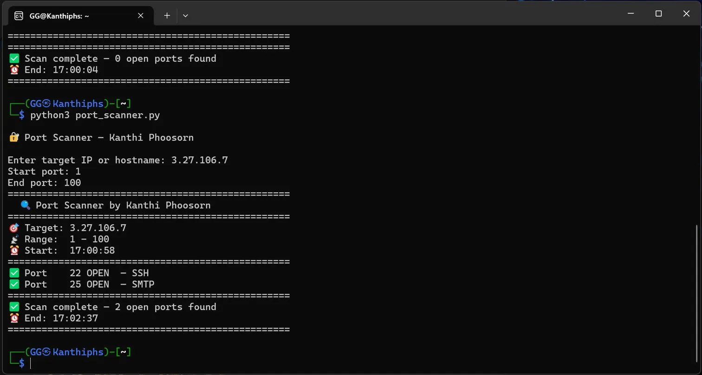

# 🔍 Project #7 — Port Scanner

**Author:** Kanthi Phoosorn  
**Date:** March 10, 2026  
**Part of:** [Cloud-Security-Engineer Portfolio](https://github.com/KanthiPhoosorn/Cloud-Security-Engineer)

## 📋 What I Did
- Built a Python port scanner from scratch
- Scanned AWS EC2 instance (3.27.106.7)
- Detected open ports: 22 (SSH) and 25 (SMTP)
- Identified services running on each port

## 🛠️ Technologies Used
- Python 3
- Socket module
- AWS EC2 (scan target)
- Kali Linux WSL2

## 🚀 How to Run
```bash
python3 port_scanner.py
```

## 📊 Scan Results — EC2 Instance
| Port | Status | Service |
|---|---|---|
| 22 | ✅ OPEN | SSH |
| 25 | ✅ OPEN | SMTP |

## ⚠️ Legal Warning
Only scan servers you own or have permission to scan.
Unauthorized scanning is illegal.

## 📸 Screenshot


## 💡 What I Learned
- TCP port scanning fundamentals
- Socket programming in Python
- Common port numbers and services
- Network reconnaissance basics

## 🔗 Related Projects
- [Project #6 — Password Checker](https://github.com/KanthiPhoosorn/Project-6-Password-Strength-Checker)
- [Project #8 — AWS IAM Setup](https://github.com/KanthiPhoosorn/Project-8-AWS-IAM-Setup)